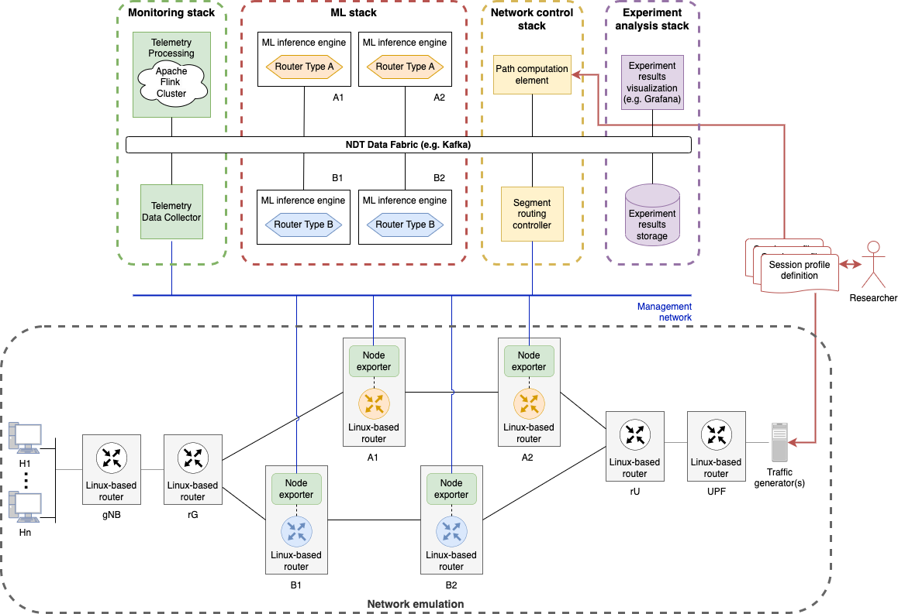

# Kubernetes Flink Operator Telemetry System

Kubernetes Flink Operator Telemetry System is a multi-service architecture to handle telemetry data from diferent network nodes. The system is formed by:
 - **Routers with node exporter running**
 - **Monitoring Stack = Telemetry Data Collector + Telemetry Processing**
 - **Telemetry Data Collector:**
    - Node exporter collector app
    - Kafka producer python microservice
 - **NDT Data Fabric**
    - Zookeeper server
    - Kafka broker
 - **Telemetry Processing**
    - Apache Flink Operator Cluster
 - **Machine Learning Stack**
    - Machine Learning Inference Engine



All of these services are deployed in a Kubernetes cluster. All the resources needed to deploy the telemetry system architecture are included in the [Kubernetes folder](Kubernetes).

## Current versions:
- **Prometheus Node Exporter**: 1.8.2
- **Prometheus Node Exporter Collector application**: 1.0.1
- **Apache Flink**: 1.14.4
- **Scala**: 2.12
- **Java**: 11

## Input metrics format

Telemetry Data Collector handles HTTP GET requests to Node Exporter Collector service trhough a pyhton microservice Kafka Producer. NDT Data Fabric input format data follows this JSON structure:

```json
{
  "node_exporter": "r1:9100",
  "epoch_timestamp": "1745233635.2172275",
  "experiment_id": "1",
  "interfaces": ["eth2"],
  "flag_debug_params": true,
  "debug_params": {
    "flag_original_metrics": true,
    "max_throughput_mbps": 100,
    "unit": "bytes",
    "polling_interval": 5,
    "test_metrics": false,
    "multiplier": 2000,
    "collector_timestamp": "1745233631.0145035"
  },
  "metrics": [
    {
      "name": "node_network_receive_bytes_total",
      "description": "Network device statistic receive_bytes.",
      "type": "counter",
      "values": [
        {
          "labels": [
            {
              "name": "device",
              "value": "eth2"
            }
          ],
          "value": "2.434326851e+09"
        }
      ]
    },
    {
      "name": "node_network_receive_packets_total",
      "description": "Network device statistic receive_packets.",
      "type": "counter",
      "values": [
        {
          "labels": [
            {
              "name": "device",
              "value": "eth2"
            }
          ],
          "value": "2.040682e+06"
        }
      ]
    }
  ]
}
```

An example JSON input file is included at [input_metrics](examples/input_metrics.json).

## ML input format

Kubernetes Flink Operator Telemetry System exposes metrics in an output JSON format which follows this structure:

```json
{
  "node_exporter": "r1:9100",
  "epoch_timestamp": "1745233728.7595372",
  "experiment_id": "1",
  "interfaces": ["eth2"],
  "flag_debug_params": true,
  "debug_params": {
    "flag_original_metrics": true,
    "max_throughput_mbps": 100,
    "unit": "bytes",
    "polling_interval": 5,
    "test_metrics": false,
    "multiplier": 2000,
    "collector_timestamp": "1745233631.0145035",
    "process_timestamp":"1745233724580"
  },
  "metrics": [
  {
    "name": "node_network_receive_bytes_total",
    "description": "Network device statistic receive_bytes.",
    "type": "counter",
    "values": [
      {
        "value": "2.434367984e+09",
        "labels": [
          {
            "name": "device",
            "value": "eth2"
          }
        ]
      }
    ]
  },
  {
    "name": "node_network_receive_packets_total",
    "description": "Network device statistic receive_packets.",
    "type": "counter",
    "values": [
      {
        "value": "2.040711e+06",
        "labels": [
          {
            "name": "device",
            "value": "eth2"
          }
        ]
      }
    ]
  }
  ],
  "input_ml_metrics": [
    {
      "name": "node_network_receive_packets_total_rate",
      "type": "rate",
      "value": 301.9684264999918
    },
    {
      "name": "node_network_average_received_packet_length",
      "type": "length",
      "value": 1464
    },
    {
      "name": "node_network_router_capacity_occupation",
      "type": "percentage",
      "value": 0.0017683271055839516
    }
  ]
}
```

An example JSON output file is included at [input_ml_metrics](examples/input_ml_metrics.json).

## ML output format

Machine Learnig (ML) inference engines are emulated through dummies which generate power consumption metrics depending on router type and router occupation. The ML metrics are included in the output JSON file at [output_ml_metrics](examples/output_ml_metrics.json).

```json
{
  "node_exporter": "r1:9100",
  "epoch_timestamp": "1745233815.5825064",
  "experiment_id": "1",
  "interfaces": ["eth2"],
  "flag_debug_params": true,
  "debug_params": {
    "flag_original_metrics": true,
    "max_throughput_mbps": 100,
    "unit": "bytes",
    "polling_interval": 5,
    "test_metrics": false,
    "multiplier": 2000,
    "collector_timestamp": "1745233811.352313",
    "process_timestamp": "1745233811395",
    "ml_timestamp": "1745233803.5055509"
  },
  "metrics": [
  {
    "name": "node_network_receive_bytes_total",
    "description": "Network device statistic receive_bytes.",
    "type": "counter",
    "values": [
      {
        "value": "2.434457428e+09",
        "labels": [
          {
            "name": "device",
            "value": "eth2"
          }
        ]
      }
    ]
  },
  {
    "name": "node_network_receive_packets_total",
    "description": "Network device statistic receive_packets.",
    "type": "counter",
    "values": [
      {
        "value": "2.040774e+06",
        "labels": [
          {
            "name": "device",
            "value": "eth2"
          }
        ]
      }
    ]
  }
  ],
  "input_ml_metrics": [
    {
      "name": "node_network_receive_packets_total_rate",
      "type": "rate",
      "value": 650.8177749595993
    },
    {
      "name": "node_network_average_received_packet_length",
      "type": "length",
      "value": 1464
    },
    {
      "name": "node_network_router_capacity_occupation",
      "type": "percentage",
      "value": 0.003811188890163414
    }
  ],
  "output_ml_metrics": [
    {
      "name": "node_network_power_consumption_wats",
      "type": "power_consumption_wats",
      "value": [698.8288]
    },
    {
      "name": "node_network_power_consumption_variation_rate_occupation",
      "type": "power_consumption_variation_rate",
      "value": [0.0]
    },
    {
      "name": "node_network_power_consumption_variation_rate_packet_length",
      "type": "power_consumption_variation_rate",
      "value": -0.0008
    }
  ]
}
```

## Docker Images

If you want to build your own Docker images, you can find the Dockerfiles for every service in the telemetry system architecture at [docker](Kubernetes/docker/).

```bash
$ cd Kubernetes/docker/flink
$ sudo docker build -t flink-operator:latest .
$ cd Kubernetes/docker/kafka_producer
$ sudo docker build -t kafka-producer:latest .
$ cd Kubernetes/docker/node-exporter-collector
$ sudo docker build -t node-exporter-collector:latest .
$ cd Kubernetes/docker/router-node-exp
$ sudo docker build -t router-node-exporter:latest .
$ cd Kubernetes/docker/ml
$ sudo docker build -t ml:latest .
```

## Configuration Parameters

 - **Config.json:** There is a JSON configuration file at [config.json](Kubernetes/config/config.json) with several configuration parameters you can change manually before running the telemetry system. A JSON schema is included at [config-schema.json](Kubernetes/config/config-schema.json) in order to validate the configuration file as follows:

```json
{
    "$schema": "http://json-schema.org/draft-07/schema#",
    "type": "object",
    "properties": {
        "experiment_id": {
            "type": "string",
            "description": "Experiment unique identifier"
        },
        "flag_original_metrics": {
            "type": "boolean",
            "description": "Flag for showing orignial node exporter's metrics or not"
        },
        "flag_debug_params": {
            "type": "boolean",
            "description": "Flag for showing debug params or not"
        },
        "max_throughput_mbps": {
            "type": "integer",
            "description": "Maximum bit rate for router's links [Mbps]"
        },
        "polling_interval": {
            "type": "integer",
            "description": "Time between node exporter collector metrics requests [s]"
        },
        "multiplier": {
            "type": "integer",
            "description": "Multiplier applied to packet releated metrics values [1:2000]"
        },
        "routers": {
            "type": "array",
            "description": "List of monitored routers",
            "items": {
                "type": "object",
                "patternProperties": {
                    ".+": {
                        "type": "object",
                        "properties": {
                            "collector_url": {
                                "type": "string",
                                "format": "uri",
                                "description": "Node exporter collector endpoint for each router's metrics"
                            },
                            "topic": {
                                "type": "string",
                                "description": "Kafka input topic for each router's metrics"
                            },
                            "interfaces": {
                                "type": "array",
                                "items": {"type": "string"},
                                "description": "List of router's interfaces monitored in each experiment"
                            },
                            "test_metrics": {
                                "type": "boolean",
                                "description": "Flag for using manual test metrics in each router or not"
                            }
                        },
                        "required": ["collector_url", "topic", "interfaces", "router_type", "test_metrics"]
                    }
                },
                "additionalProperties": false
            }
        }
    },
    "required": [
        "experiment_id",
        "flag_original_metrics",
        "flag_debug_params",
        "max_throughput_mbps",
        "polling_interval",
        "multiplier",
        "routers"
    ]
}
```

## Deployment

In [Kubernetes folder](Kubernetes) you can find [k8s-deploy.sh](Kubernetes/k8s-deploy.sh). This script will deploy all the services needed to run the telemetry system architecture.

```bash
$ cd Kubernetes
$ chmod +x ./k8s-deploy.sh
$ ./k8s-deploy.sh
```
 - **ConfigMaps**

```shell
$ kubectl create configmap config-json --from-file=config/config.json
$ kubectl create configmap test-metrics-configmap $TEST_FILES
```

 - **Cert-Manager and Flink Operator**

```shell
$ kubectl apply -f https://github.com/jetstack/cert-manager/releases/download/v1.8.1/cert-manager.yaml
$ kubectl apply -f https://github.com/spotify/flink-on-k8s-operator/releases/download/v0.5.1-alpha.3/flink-operator.yaml
```

 - **NDT Data Fabric + Node Exporter Collector**

```shell
$ kubectl apply -f ./templates/node-exporter-collector.yaml
$ kubectl apply -f ./templates/zookeeper.yaml
$ kubectl apply -f ./templates/kafka.yaml
```

 - **Flink Operator Cluster**

```shell
$ kubectl apply -f ./templates/flink-cluster.yaml
```

 - **Routers, Flink Jobs and Machine Learning Dummies**

```shell
$ kubectl apply -f "./templates/routers/${router}.yaml"
$ kubectl apply -f "./templates/jobs/flink-job-submitter-${router}.yaml"
$ kubectl apply -f "./templates/ml/ml-${router}.yaml"
```

 - **Kafka Producer Microservice**

```shell
$ kubectl apply -f ./templates/kafka-producer.yaml
```

## Experiment

To change the telemetry system parameters to perform a new experiment, you need to:

 - **Edit configmap from where the Telemetry Data Collector takes the configuration parameters**

 ```shell
$ kubectl edit configmap config-json
 ```
 - **Restart Kafka Producer microservice in order to take the new configuration parameters**

 ```shell
$ kubectl rollout restart deployment kafka-producer
 ```

